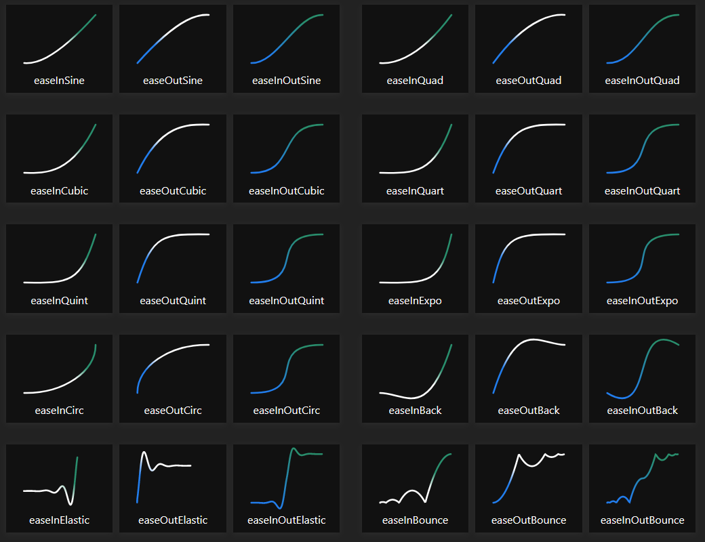

# Easings - Documentation

## Using the package

This package should be really easy and straightforward to use.
You only need to import the Easings namespace with :

    using GameLibrary.Easings;

Then you can use any easing function directly in your C# script :

    Easing.QuadraticEaseInOut(0.73f);

You can also use the Interpolate function, which is equivalent :

    Easing.Interpolate(0.73f, Easing.Ease.QuadraticEaseInOut);

## Functions

You can visualize the different easing functions that have been implemented in this repo with this website : [easings.net](https://easings.net).  
Here is a preview :  

